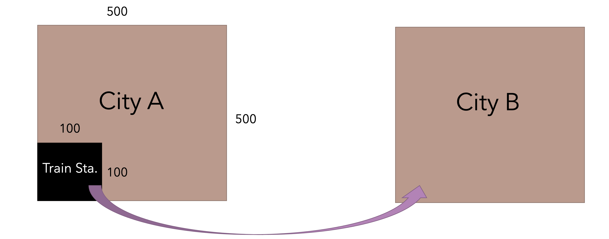
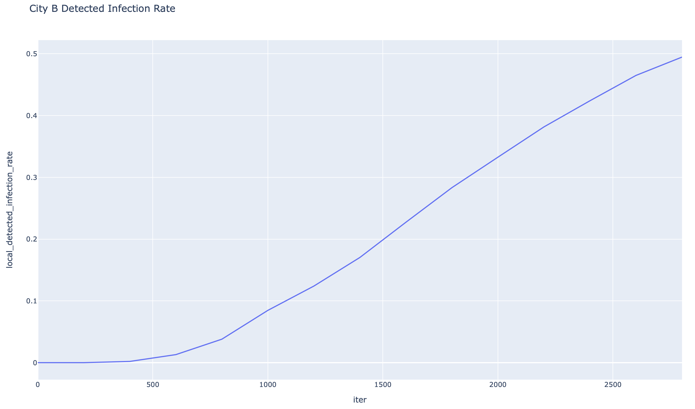
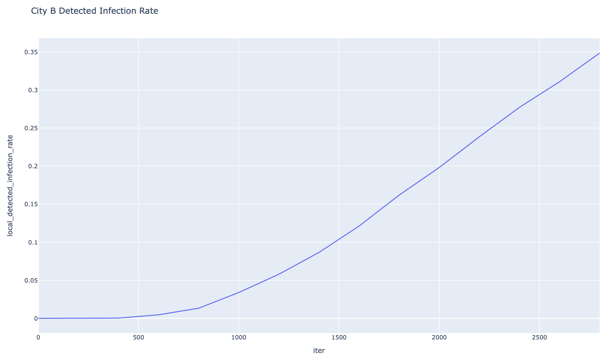
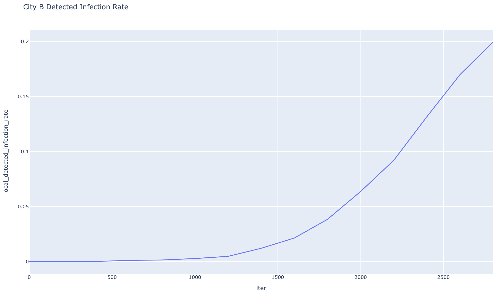
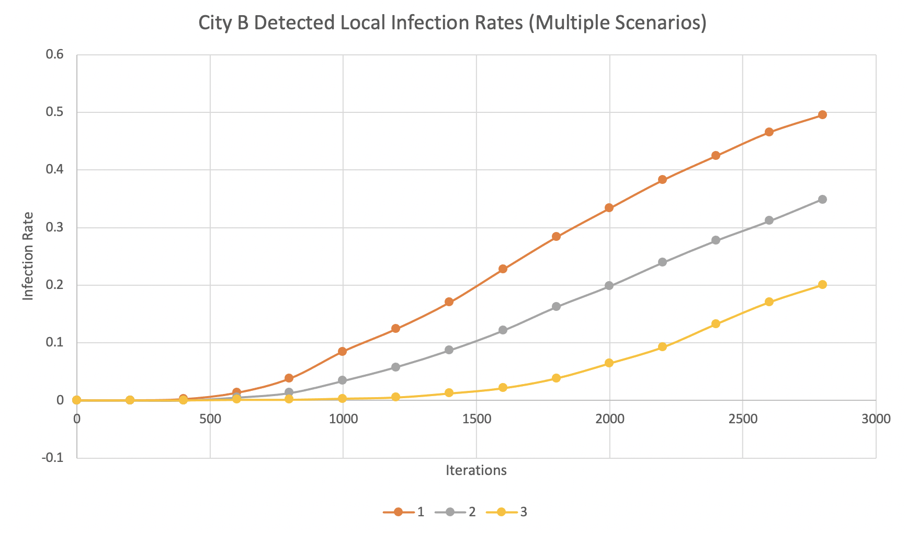

# IS 597 PRO Fall 2020 Final Project

#### Title: Twins City COVID-19 Spreading Monte Carlo Simulation
#### Author: Erick Li

### Introduction

COVID-19, the maniac that messed up the year of 2020, spread all over the world. It caused significant disruption, especially on international travels. Human has to learn something from it, right? This project aims to find out how a government should react to such a global crisis. How should they implement travel restrictions or traveler quarantine?

There are only two cities--A & B (simple enough to remember, hmm?) in the imaginary world. There is a train service between A & B. In my simulation, people can only travel from A to B, and we ignore the travel time. Some people in City A got COVID-19 mysteriously. How should City B react?

### Hypothesis
Implementing travel restrictions or mandatory quarantine can significantly help prevent the virus from spreading from City A to City B.

### Scenarios
It also shows the line chart of the detected local infection rate for each scenarios. The configurations of the simulation:
| Configurations | Values |
| ------------- | ------------- |
| Rounds of Simulation | 30 |
| Iterations | 3000 |
| City Size | 500 x 500 |
| Station Size | 100 x 100|
| City Population | 100|
| City A Initial Infection Rate | 0.05 |
| City A Initial Masked Rate | 0.5 |

#### One: Without any restrictions

#### Two: City B quarantines people who shows symptoms

#### Three: City B quarantines all travelers from City A

### Analysis
The comparison of the detected local infection rates across different scenarios.

The spreading speed of the virus is slower under Scenarios 2 and 3. However, they slow the spread while the case numbers still climb up lately. According to my assumptions, all the citizens in City B don't wear masks. Implementing travel restrictions or mandatory quarantine could prevent a major spread from travelers from City A to people in City B in the early stage. However, it is still possible that one or two infected people from City A infect the residents in City B, who becomes the source of local spreads. Hence, the simulation proves that only enforcing travel-related restrictions cannot effectively prevent the local spread but merely slow it. The initial result does not support the hypothesis. The City is supposed to act further, potentially including asking residents to wear masks and stay at home for a while.
